# Engram

**Unified multi-agent memory for OpenClaw.**

An elephant never forgets. Neither should your agents.

Engram is a shared memory layer that any OpenClaw agent can plug into. Local-first vector search via LanceDB, cloud-synced through Convex, with full agent-native architecture.

## What It Does

- **Store** atomic facts, entities, and conversations across agents
- **Recall** semantically — vector search finds what matters, not just what matches
- **Share** memory between agents with scoped access control
- **Decay** gracefully — old memories fade but never disappear
- **Sync** across devices — Mac Mini, MacBook Air, MacBook Pro all see the same brain
- **Enrich** automatically — embeddings, importance scoring, lifecycle management

## Quick Start

```bash
# Install MCP server dependencies
cd mcp-server && npm install && npx tsc

# Set environment variables
export CONVEX_URL="https://your-deployment.convex.cloud"
export ENGRAM_AGENT_ID="your-agent-id"
export COHERE_API_KEY="your-cohere-key"  # Optional: enables real embeddings

# Run the MCP server
node mcp-server/dist/index.js
```

### Claude Code / MCP Client Configuration

```json
{
  "mcpServers": {
    "engram": {
      "command": "node",
      "args": ["/path/to/engram/mcp-server/dist/index.js"],
      "env": {
        "CONVEX_URL": "https://your-deployment.convex.cloud",
        "ENGRAM_AGENT_ID": "indy",
        "COHERE_API_KEY": "your-key"
      }
    }
  }
}
```

## Architecture

> Diagrams available in [dark (tokyo-night)](docs/diagrams/) and [light (github-light)](docs/diagrams/light/) themes.


### Data Flow — Store & Recall


### Memory Lifecycle


### Enrichment Pipeline — Async Fact Processing



### Memory Scopes — Multi-Agent Access Control


### Importance Scoring — Multi-Factor Relevance


### Agent Lifecycle


## MCP Tools (12 Primitives)

| Tool | Description |
|------|-------------|
| `memory_store_fact` | Store atomic fact, triggers async enrichment |
| `memory_recall` | Semantic search (primary retrieval), returns recallId |
| `memory_search` | Full-text + structured filters |
| `memory_link_entity` | Create/update entities and relationships |
| `memory_get_context` | Warm start: facts + entities + themes |
| `memory_observe` | Fire-and-forget observation storage |
| `memory_register_agent` | Agent self-registration with capabilities |
| `memory_query_raw` | Escape hatch for direct Convex queries |
| `memory_record_signal` | Record ratings/sentiment feedback (PAI) |
| `memory_record_feedback` | Post-recall usefulness tracking (ALMA) |
| `memory_summarize` | Consolidate facts on a topic |
| `memory_prune` | Agent-initiated cleanup of stale facts |

## Tech Stack

- **Convex** — Cloud backend (10 tables, native vector search, scheduled functions, crons)
- **LanceDB** — Local vector search (sub-10ms, offline, mergeInsert sync)
- **TypeScript** — MCP server + Convex functions
- **Cohere Embed 4** — Multimodal embeddings (1024-dim: `embed-v4.0`)
- **MCP SDK** — `@modelcontextprotocol/sdk` v1.x (stdio transport)

## Convex Schema (10 Tables)

| Table | Purpose |
|-------|---------|
| `facts` | Atomic memory units with embeddings, importance, lifecycle |
| `entities` | Named concepts with relationship graph |
| `conversations` | Thread facts together with handoff tracking |
| `sessions` | Agent session tracking |
| `agents` | Agent registry with capabilities and telos |
| `memory_scopes` | Scope-based access control with policies |
| `signals` | Feedback loop (ratings + sentiment) |
| `themes` | Thematic fact clusters (consolidated memory) |
| `sync_log` | Per-node LanceDB sync tracking |

## Cron Jobs (7 Scheduled)

| Job | Schedule | Purpose |
|-----|----------|---------|
| Decay | Daily | Differential relevance decay by fact type |
| Forget | Daily | Archive facts with high forget score |
| Compact | Daily | Conversation compaction |
| Consolidate | Weekly | Merge related facts into themes |
| Rerank | Weekly | Recalculate importance scores |
| Rules | Monthly | Extract steering rules from patterns |
| Cleanup | Daily | Garbage collection + sync log cleanup |

## Agent-Native Principles

1. **Parity** — Every agent gets the same memory tools
2. **Granularity** — Atomic primitives, not workflow-shaped APIs
3. **Composability** — New memory behaviors = new prompts, not new code
4. **Emergent Capability** — Raw query escape hatch for unanticipated use
5. **Improvement Over Time** — Memory IS the improvement mechanism

## Project Structure

```
engram/
├── convex/                  # Convex backend
│   ├── schema.ts            # 10 tables with indexes
│   ├── functions/           # CRUD + search (9 modules)
│   ├── actions/             # Async: embed, importance, vectorSearch, enrich
│   ├── crons.ts             # 7 cron job configuration
│   └── crons/               # Cron implementations
├── mcp-server/              # MCP server (TypeScript)
│   ├── src/
│   │   ├── index.ts         # Server entry point (12 tools)
│   │   ├── tools/           # 12 tool implementations
│   │   └── lib/             # convex-client, lance-sync, embeddings
│   └── package.json
├── skill/                   # OpenClaw skill package
│   ├── SKILL.md
│   └── install.sh
└── docs/                    # Research + plans
    ├── research/            # Architecture research papers
    └── plans/               # Implementation plans
```

## Status

Phases 1-6 complete. Core system operational. See [PLAN.md](./PLAN.md) for detailed checklist.

**Verified via reloaderoo:**
- All 12 MCP tools listed with correct schemas
- `memory_store_fact` stores facts end-to-end with async enrichment
- `memory_recall` retrieves stored facts with access bumping
- Convex deploy + MCP server build clean (zero TypeScript errors)

## License

MIT
