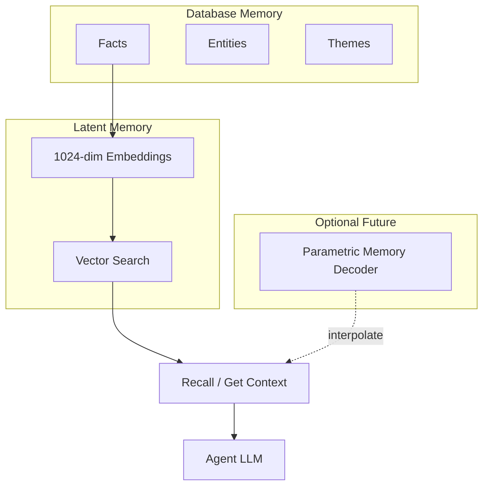

# Memory Research Synthesis: What Engram Can Learn from Recent Work

## What We're Exploring

Engram sits at the intersection of **database memory** (facts, entities, themes) and **latent memory** (embeddings, semantic search). This brainstorm synthesizes insights from four research threads: **Memory Decoder** (parametric memory mimicking retrieval), **MemFly** (Information Bottleneck for agentic memory), **latent vs. database memory** (Richard Aragon's framing), and **geometry of decision-making** (intrinsic dimension, compression, decisiveness). The goal is to identify actionable design ideas that fit Engram's architecture—multi-agent, Convex, scope-based—without adopting incompatible stacks or replacing core retrieval.

---

## Current State: Engram in the Framework

| Dimension | Engram Today | Database Memory | Latent Memory |
|-----------|--------------|-----------------|---------------|
| **Facts** | Structured, queryable | ✓ Explicit | — |
| **Embeddings** | 1024-dim Cohere | — | ✓ Geometric |
| **Retrieval** | Per-turn vector + text | — | ✓ Approximate |
| **Context injection** | Dynamic recall each turn | — | ✓ Reprojection-like |
| **Parametric memory** | None | — | — (Memory Decoder adds this) |

---

## Ideas Worth Implementing

### 1. Explicit Two-Layer Framing

**What the research says:** [Latent Space vs. Database Memory](https://richardaragon.substack.com/p/latent-space-memory-vs-database-memory) distinguishes symbolic, discrete, auditable storage from geometric, continuous, emergent representation. AI systems need both.

**Engram relevance:** Engram already implements both layers—facts/entities/themes as database, embeddings/vector search as latent—but doesn't document the separation. Clarifying which tools operate on which layer improves design coherence.

**Approach:**
- Add an architecture section to docs describing database vs. latent layers.
- Tag tools by layer: `store_fact`, `link_entity`, `search_facts` → database; `vector_search`, `recall` (semantic path) → latent.
- Document how the two layers interact (e.g., facts flow to embeddings; recall combines both).

**Best when:** Onboarding contributors or designing new tools—the framing prevents mixing concerns.

---

### 2. Formatting for Decisiveness

**What the research says:** [Geometry of Decision Making](https://arxiv.org/abs/2511.20315) finds that model decisiveness (commitment to a prediction) correlates with representational compression. Few-shot examples and structured context reduce final-layer intrinsic dimension and improve generalization.

**Engram relevance:** Engram doesn't control the LLM's internal layers, but *how* recalled facts are formatted for prompt injection may affect how "compression-friendly" the context is—grouped, prioritized, with clear structure.

**Approach:**
- Structure recalled facts for compression-friendly consumption: grouped by date or theme, prioritized by tier.
- Align with [observational memory brainstorm](2026-02-20-observational-memory-inspiration.md)'s emoji prefix (🔴/🟡/🟢) and formatted observation blocks.
- When building context in `load_budgeted_facts` / `get_context`, output dated, bulleted blocks instead of flat lists.

**Best when:** You want the model to parse and weight recalled context more effectively.

---

### 3. Optional Parametric Memory (Experimental)

**What the research says:** [Memory Decoder](https://arxiv.org/abs/2508.09874) trains a small transformer decoder to imitate kNN retrieval distributions. Once trained, it interpolates with the base LM—no datastore lookup at inference. Plug-and-play across models sharing the same tokenizer.

**Engram relevance:** Engram is retrieval-based. Memory Decoder suggests a hybrid: keep the database for facts, but add a parametric "scope memory" that compresses domain patterns for faster, retrieval-free inference on hot paths.

**Approach:**
- Long-term experiment: train a small scope-specific decoder on fact embeddings to predict retrieval distributions.
- Apply only for high-traffic scopes (e.g., per-project "domain memory").
- Do not replace retrieval; interpolate as augmentation.

**Best when:** Per-turn retrieval latency becomes a bottleneck for specific scopes.

---

### 4. Temporal Geometry

**What the research says:** Richard Aragon: "Latent memory is temporal." The geometry of latent space reflects temporal conditioning—ordering, sequences, transitions.

**Engram relevance:** Facts have `createdAt`, but referenced dates (e.g., "User's deadline is March 15") are buried in content. Explicit temporal structure in context blocks improves temporal reasoning.

**Approach:**
- Add optional `referencedDate` and `relativeDate` fields (or extract in enrichment).
- When formatting facts for context, append relative anchors: `(created 3 days ago; references March 15, 2026)`.
- Align with [observational memory brainstorm](2026-02-20-observational-memory-inspiration.md)'s temporal anchoring idea (#2).

**Best when:** You need strong temporal reasoning (deadlines, "when did X happen", preference changes over time).

---

### 5. IB-Informed Consolidation

**What the research says:** [MemFly](https://arxiv.org/abs/2602.07885) formalizes agentic memory as an Information Bottleneck problem: minimize compression entropy I(X;M) while maximizing relevance I(M;Y). Uses Merge (redundant), Link (complementary), Append (novel) operations.

**Engram relevance:** `consolidate` cron clusters facts by entity sets into themes. MemFly adds explicit semantics: Merge when highly redundant, Link when complementary, Append when novel. Could inform when to merge vs. link facts.

**Approach:**
- Formalize consolidate/compact crons around minimizing redundancy while preserving retrieval-relevant structure.
- Use embedding similarity (or lightweight redundancy score) to decide merge vs. link.
- Consider LLM-based merge/link decisions only for high-value scopes (adds cost).

**Best when:** You want principled consolidation that preserves evidence chains without over-compressing.

---

### 6. Tri-Pathway Retrieval

**What the research says:** MemFly uses macro-semantic (Topics), micro-symbolic (Keywords), and topological expansion (associative edges) for retrieval. Tri-pathway fusion improves multi-hop and entity-centric queries.

**Engram relevance:** Engram has vector search, text search, and `get_graph_neighbors`. These map to MemFly's pathways: vector = macro-semantic, text/entity = micro-symbolic, graph = topological. Currently recall merges vector + text; graph expansion is separate.

**Approach:**
- Document the three pathways (semantic, symbolic, graph) in retrieval design.
- Unify `get_graph_neighbors` into the recall pipeline for entity-centric queries—expand from initial vector/text results along entity/theme edges.
- Consider Reciprocal Rank Fusion (RRF) when combining pathways, per MemFly.

**Best when:** Queries require multi-hop reasoning or entity-centric evidence chains.

---

### 7. Iterative Evidence Refinement

**What the research says:** MemFly's Iterative Evidence Refinement (IER) protocol: if the initial evidence pool is insufficient, synthesize sub-queries, re-retrieve, and expand the pool until sufficient.

**Engram relevance:** `get_context` and `load_budgeted_facts` do single-pass retrieval. Complex queries may need multi-step recall.

**Approach:**
- Add optional `iterativeRefinement: true` to `load_budgeted_facts` or a new `recall_iterative` tool.
- If initial evidence is low-confidence or sparse, use an LLM to generate sub-queries and re-retrieve.
- Cap iterations (e.g., max 3) to avoid runaway latency.

**Best when:** Complex multi-hop or open-domain queries where single-pass recall misses critical evidence.

---

## What NOT to Adopt (and Why)

| Source Idea | Why Skip for Engram |
|-------------|---------------------|
| **Replace retrieval with Memory Decoder** | Engram's multi-agent, scope-based semantic search is core. Full replacement would break recall, cross-session search. |
| **DAPT-style domain pretraining** | Engram doesn't own the LLM; agents do. Not in scope. |
| **Measure intrinsic dimension in Engram** | Geometry paper analyzes model internals. Engram is external memory; no direct ID measurement. |
| **MemFly's full graph + Neo4j stack** | Engram uses Convex; migrating to a graph DB is out of scope. Adopt concepts (IB, tri-pathway) not the stack. |

---

## Prioritization (YAGNI-Friendly)

**Quick wins (docs + formatting):**
1. **Explicit two-layer framing** (#1) — Document database vs. latent in architecture.
2. **Formatting for decisiveness** (#2) — Emoji prefix + structured blocks (align with [observational memory](2026-02-20-observational-memory-inspiration.md) #1, #6).

**Medium effort:**
3. **Temporal geometry** (#4) — Add referencedDate/relativeDate; format in context.
4. **IB-informed consolidation** (#5) — Merge/link/append semantics in consolidate cron.
5. **Tri-pathway retrieval** (#6) — Wire `get_graph_neighbors` into recall; document pathways.

**Experimental / future:**
6. **Parametric memory** (#3) — Scope-specific decoder for hot paths.
7. **Iterative evidence refinement** (#7) — Multi-step recall for complex queries.

---

## Key Decisions

- **Keep database and latent layers explicit and complementary** — Design for both; document the split.
- **Use geometry insights for formatting only** — Improve context presentation, not storage.
- **Treat Memory Decoder as inspiration** — Optional parametric augmentation, not replacement.
- **Adopt MemFly concepts, not stack** — IB, tri-pathway, Merge/Link/Append; stay on Convex.

---

## Open Questions

- Can a parametric "scope memory" be trained on fact embeddings without LLM access?
- How do Sidecar / GAN Sidecar architectures relate to Engram's MCP-based design?
- Can consolidate/compact crons adopt Merge/Link/Append semantics without the full MemFly stack?

---

## References

- [Memory Decoder](https://arxiv.org/abs/2508.09874) — Plug-and-play parametric memory for LLMs
- [Latent Space vs. Database Memory](https://richardaragon.substack.com/p/latent-space-memory-vs-database-memory) — Richard Aragon, Substack
- [Geometry of Decision Making](https://arxiv.org/abs/2511.20315) — Intrinsic dimension, decisiveness
- [MemFly](https://arxiv.org/abs/2602.07885) — Information Bottleneck for agentic memory
- [YouTube XIFxg_WSBDk](https://www.youtube.com/watch?v=XIFxg_WSBDk) — *(summarize after viewing)*
- Sidecar Memory, GAN Sidecar, AI Agent Memory Tutorial (Google Docs) — add when accessible

---

## Engram in the Memory Taxonomy

---

## Next Steps

→ Implement emoji prefix + formatted observation blocks in context builders (shared with [observational memory brainstorm](2026-02-20-observational-memory-inspiration.md)).
→ Document two-layer framing in architecture docs.
→ Review YouTube video XIFxg_WSBDk and add summary to this doc when available.
