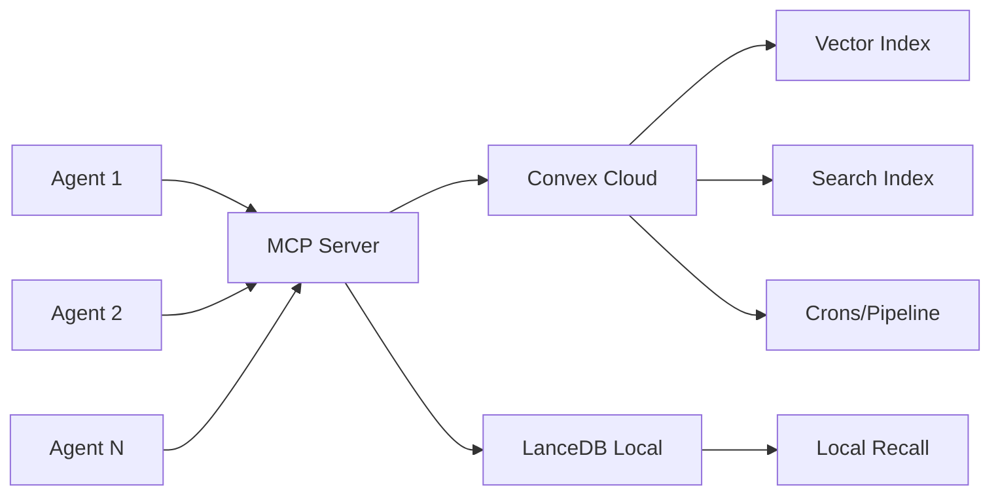
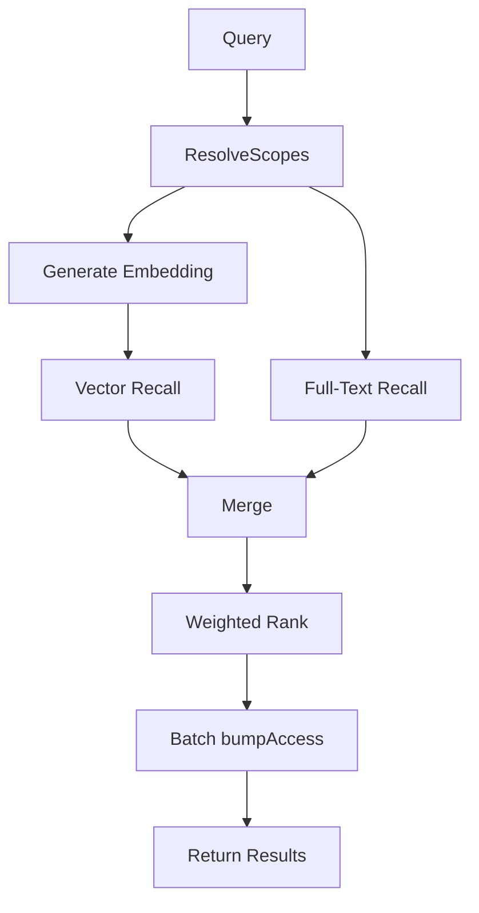
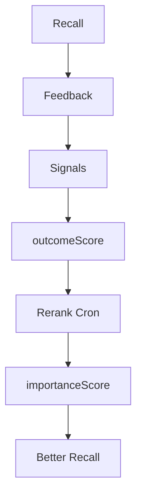
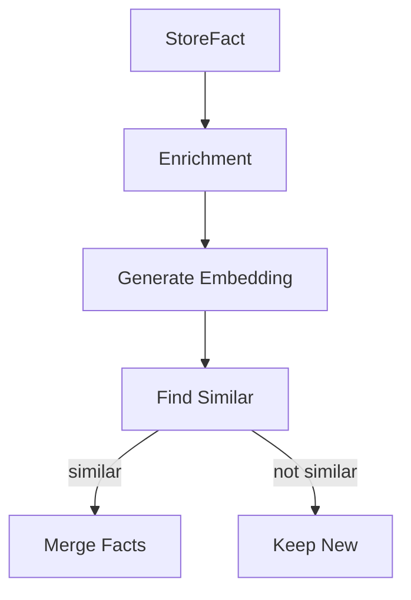
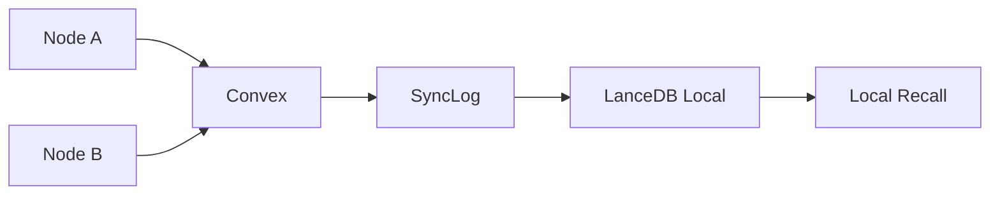

# Architecture

```mermaid
flowchart LR
    Agent1[Agent 1] --> MCP[MCP Server]
    Agent2[Agent 2] --> MCP
    Agent3[Agent N] --> MCP
    MCP --> Convex[Convex Cloud]
    MCP --> Lance[LanceDB Local]
    Convex --> VI[Vector Index]
    Convex --> SI[Search Index]
    Convex --> Crons[Crons/Pipeline]
    Lance --> LR[Local Recall]
```

# Hybrid Recall Flow

```mermaid
flowchart TD
    Query --> ResolveScopes
    ResolveScopes --> GenEmbed[Generate Embedding]
    GenEmbed --> VR[Vector Recall]
    ResolveScopes --> FT[Full-Text Recall]
    VR --> Merge
    FT --> Merge
    Merge --> Rank[Weighted Rank]
    Rank --> Bump[Batch bumpAccess]
    Bump --> Return[Return Results]
```

# Feedback Loop

```mermaid
flowchart TD
    Recall --> Feedback
    Feedback --> Signals
    Signals --> OS[outcomeScore]
    OS --> Rerank[Rerank Cron]
    Rerank --> IS[importanceScore]
    IS --> Better[Better Recall]
```

# Synthesis

```mermaid
flowchart TD
    Store[StoreFact] --> Enrich[Enrichment]
    Enrich --> Embed[Generate Embedding]
    Embed --> Find[Find Similar]
    Find -->|similar| Merge[Merge Facts]
    Find -->|not similar| Keep[Keep New]
```

# Sync Topology

```mermaid
flowchart LR
    NodeA[Node A] --> Convex
    NodeB[Node B] --> Convex
    Convex --> SyncLog
    SyncLog --> Lance[LanceDB Local]
    Lance --> LR[Local Recall]
```
