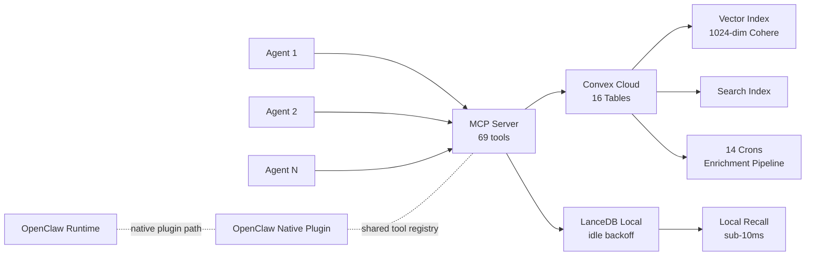
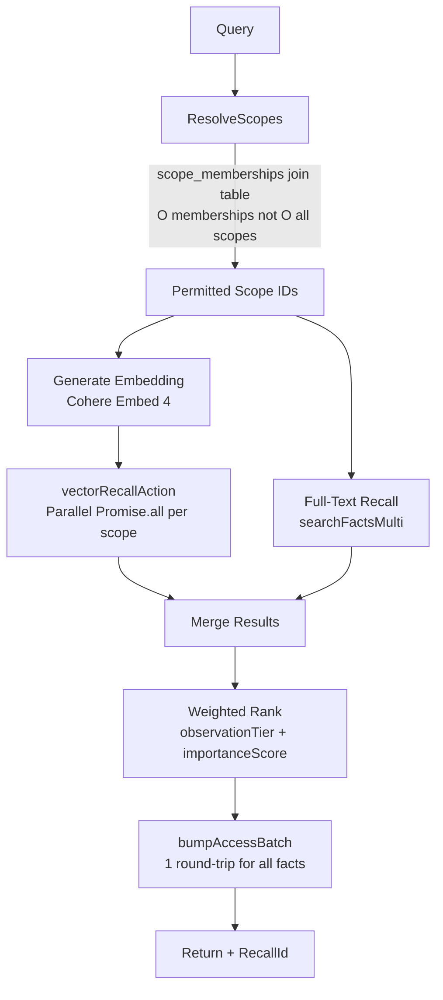
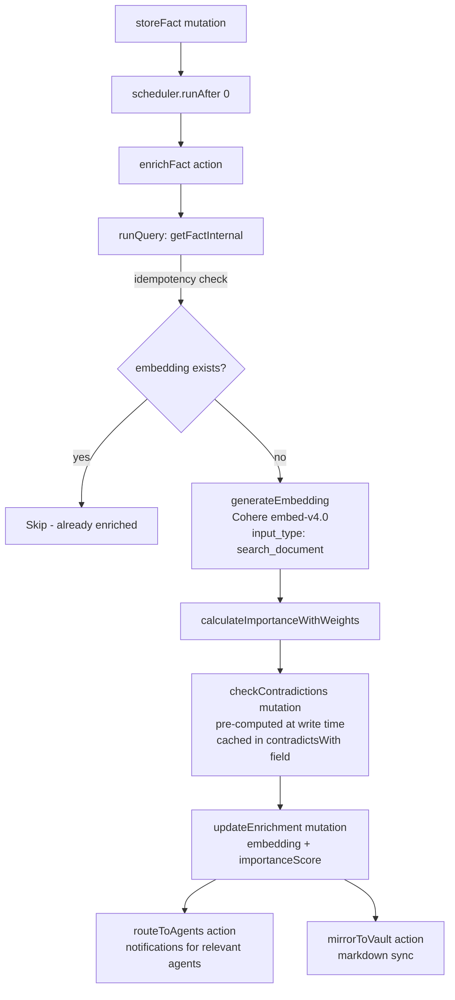
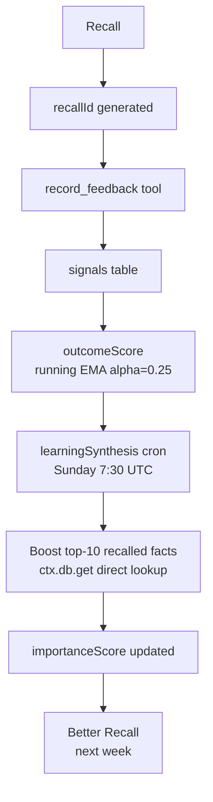
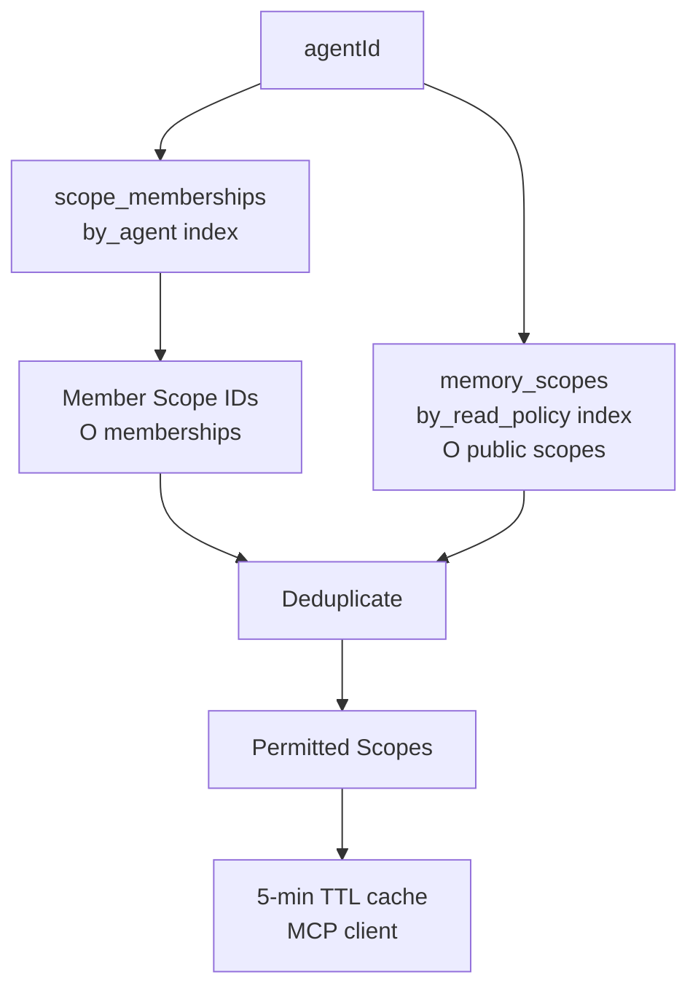
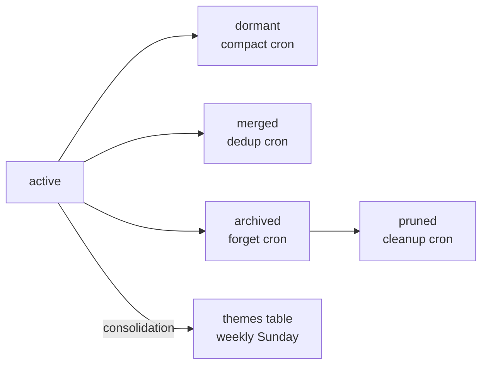
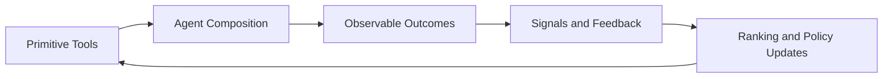
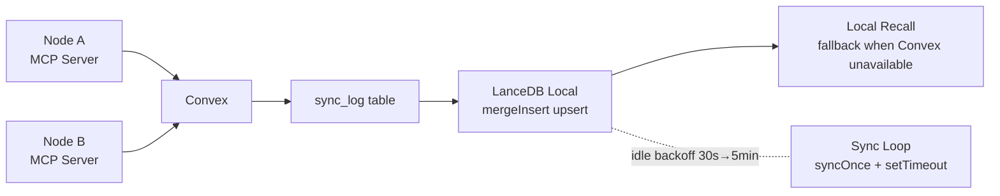
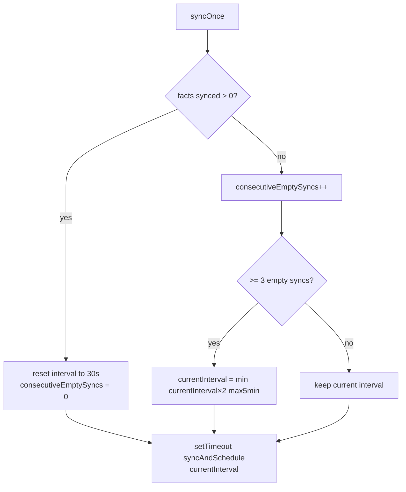

# Architecture

# Hybrid Recall Flow

# Enrichment Pipeline

# Feedback Loop

# Scope Lookup — Join Table Pattern

# Memory Lifecycle

# Philosophy Loop

# Sync Topology

# LanceDB Backoff Pattern

