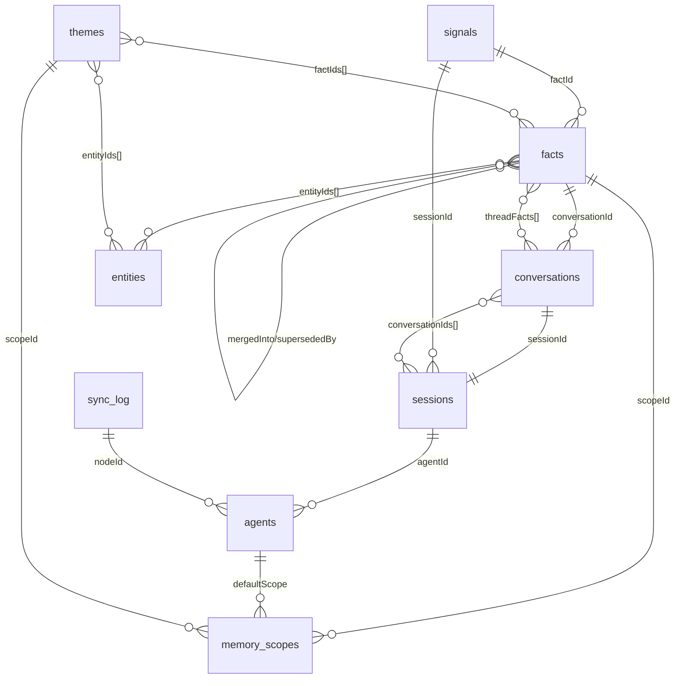

# Engram Phase 1: Foundation

## Overview

Initialize the Convex backend for Engram with all 10 tables, complete CRUD operations, full-text search on facts, scope-based write permission enforcement, and a seed script. This is the data layer that all subsequent phases build on.

**Scope:** Convex cloud only. No MCP server, no LanceDB, no embeddings, no enrichment pipeline.

## Problem Statement

Engram has a complete plan (PLAN.md) and extensive research, but zero implementation code. Phase 1 establishes the foundational data layer that every other phase depends on. Getting the schema right now avoids costly migrations later.

## Proposed Solution

Deploy the **full PLAN.md schema** (all optional future-phase fields included) to Convex on day 1. This prevents schema migrations when later phases add lifecycle management, emotional context, temporal links, etc. Optional fields cost nothing until populated.

---

## Technical Approach

### Schema Decision: Full vs Simplified

The repo-research agent identified schema discrepancies between PLAN.md and the detailed plan:

| Field | PLAN.md | Detailed Plan | Decision |
|-------|---------|---------------|----------|
| `facts.lifecycleState` | 5 states | `status` (3 states) | **Use PLAN.md** — `lifecycleState` with 5 states |
| `facts.factualSummary` | Yes | No | **Include as optional** — SimpleMem compressed representation |
| `facts.updatedAt` | Yes | No | **Include as optional** — needed for sync tracking |
| `facts.outcomeScore` | Yes | No | **Include as optional** — MemRL learned utility |
| `facts.contributingAgents` | Yes | No | **Include as optional** — collaborative provenance |
| `facts.emotionalContext` | Yes | No | **Include as optional** — GIZIN emotional memory |
| `facts.emotionalWeight` | Yes | No | **Include as optional** — affects decay resistance |
| `facts.temporalLinks` | Yes | No | **Include as optional** — MAGMA pattern |
| `facts.forgetScore` | Yes | No | **Include as optional** — ALMA forgetting |
| `facts.mergedInto` | Yes | No | **Include as optional** — consolidation pointers |
| `facts.consolidatedFrom` | Yes | No | **Include as optional** — consolidation provenance |
| `facts.supersededBy` | Yes | No | **Include as optional** — newer fact pointer |
| `conversations.threadFacts` | Yes | No | **Include** — facts-to-conversations linking |
| `sessions.conversationIds` | Yes | No | **Include** — session-conversation links |
| `agents.telos` | Yes | No | **Include as optional** — PAI purpose/goal |
| `memory_scopes.memoryPolicy` | Yes | No | **Include as optional** — per-scope memory policies |
| `memory_scopes.idealStateCriteria` | Yes | No | **Include as optional** — PAI ISC tracking |

**Rationale:** Convex schema changes require explicit migrations. Adding fields later is friction. All future-phase fields are `v.optional()` and cost nothing until populated. Deploy once, never migrate schema.

### Convex Function Organization

```
convex/
  schema.ts                    # All 10 tables (full PLAN.md schema)
  functions/
    facts.ts                   # storeFact, getFact, getByIds, search, updateEnrichment, bumpAccess
    entities.ts                # upsert, get, getByEntityId, addRelationship, search
    conversations.ts           # create, addFact, addHandoff, getBySession
    sessions.ts                # create, updateActivity, getByAgent
    agents.ts                  # register, get, updateLastSeen
    scopes.ts                  # create, getPermitted, addMember, removeMember, checkWriteAccess
    signals.ts                 # recordSignal, getByFact, getByAgent
    themes.ts                  # create, update, getByScope, search
    sync.ts                    # getFactsSince, updateSyncLog, getSyncStatus
scripts/
  seed.ts                      # Populate initial entities + default scopes
```

### Key Implementation Patterns

#### 1. Shared Helper Pattern (queries + internal queries)

```typescript
// Shared helper — not exported as a Convex function
async function getFactHelper(ctx: QueryCtx, factId: Id<"facts">) {
  return await ctx.db.get(factId);
}

// Public query
export const getFact = query({
  args: { factId: v.id("facts") },
  handler: async (ctx, { factId }) => getFactHelper(ctx, factId),
});

// Internal query (for actions/crons)
export const getFactInternal = internalQuery({
  args: { factId: v.id("facts") },
  handler: async (ctx, { factId }) => getFactHelper(ctx, factId),
});
```

#### 2. Write Permission Enforcement on storeFact

```typescript
export const storeFact = mutation({
  args: { /* ... */ },
  handler: async (ctx, args) => {
    // 1. Check write permission
    const scope = await ctx.db.get(args.scopeId);
    if (!scope) throw new Error("Scope not found");

    if (scope.writePolicy === "members") {
      if (!scope.members.includes(args.createdBy)) {
        throw new Error(`Agent ${args.createdBy} not authorized to write to scope ${scope.name}`);
      }
    } else if (scope.writePolicy === "creator") {
      // Only the scope creator can write
      // (need to track creator — use first member as creator for now)
      if (scope.members[0] !== args.createdBy) {
        throw new Error(`Only scope creator can write to ${scope.name}`);
      }
    }
    // writePolicy === "all" → no check needed

    // 2. Insert fact with quick importance estimate
    const quickImportance = estimateImportance(args.content);
    const factId = await ctx.db.insert("facts", {
      content: args.content,
      source: args.source ?? "direct",
      entityIds: args.entityIds ?? [],
      tags: args.tags ?? [],
      factType: args.factType ?? "observation",
      scopeId: args.scopeId,
      createdBy: args.createdBy,
      conversationId: args.conversationId,
      timestamp: Date.now(),
      relevanceScore: 1.0,
      accessedCount: 0,
      importanceScore: quickImportance,
      lifecycleState: "active",
    });

    // 3. Schedule async enrichment (stub — action not implemented until Phase 3)
    // await ctx.scheduler.runAfter(0, internal.actions.enrich.enrichFact, { factId });

    return { factId, importanceScore: quickImportance };
  },
});
```

#### 3. Batch Insert Pattern (for seed script)

```typescript
// Single atomic transaction for batch inserts
export const insertBatch = internalMutation({
  args: { entities: v.array(v.object({ /* ... */ })) },
  handler: async (ctx, { entities }) => {
    const ids = [];
    for (const entity of entities) {
      const id = await ctx.db.insert("entities", entity);
      ids.push(id);
    }
    return ids;
  },
});
```

#### 4. Full-Text Search with Scope Filtering

```typescript
export const searchFacts = query({
  args: {
    query: v.string(),
    scopeId: v.optional(v.id("memory_scopes")),
    factType: v.optional(v.string()),
    createdBy: v.optional(v.string()),
    limit: v.optional(v.number()),
  },
  handler: async (ctx, args) => {
    let search = ctx.db
      .query("facts")
      .withSearchIndex("search_content", (q) => {
        let s = q.search("content", args.query);
        if (args.scopeId) s = s.eq("scopeId", args.scopeId);
        if (args.factType) s = s.eq("factType", args.factType);
        if (args.createdBy) s = s.eq("createdBy", args.createdBy);
        return s;
      });

    return await search.take(args.limit ?? 10);
  },
});
```

---

## Acceptance Criteria

### Functional Requirements

- [ ] `npx convex dev` runs successfully with all 10 tables visible in dashboard
- [ ] Can insert a fact via `storeFact` mutation with scope write permission check
- [ ] Can query facts by scope, agent, type, and importance indexes
- [ ] Full-text search on `facts.content` returns results filtered by `scopeId`, `factType`, `createdBy`
- [ ] All 10 tables have basic CRUD (create, read, update for mutable fields)
- [ ] Seed script populates initial entities (Ryan, Indy, OpenClaw, Engram, Convex, LanceDB, Cohere) and default scopes (global, private-indy)
- [ ] Write to scope with `writePolicy: "members"` fails for non-members
- [ ] Schema uses PLAN.md full version (all optional fields for future phases)

### Non-Functional Requirements

- [ ] TypeScript strict mode enabled
- [ ] No `any` types in function args/returns (use Convex `v` validators)
- [ ] All functions use proper `query`/`mutation`/`internalQuery`/`internalMutation` wrappers

### Quality Gates

- [ ] `npx convex dev` compiles without errors
- [ ] Convex dashboard shows all 10 tables with correct indexes
- [ ] Can round-trip: insert fact → search fact → get fact by ID

---

## Tasks

### 1. Initialize Convex Project
- Run `npx create-convex` in repo root
- Verify `convex/` directory created with `_generated/`, `tsconfig.json`
- Verify `package.json` updated with `convex` dependency
- Note: `convex/_generated/` should be committed per Convex best practices

### 2. Define Schema (`convex/schema.ts`)
- All 10 tables from PLAN.md (lines 89-289)
- Use full schema with all optional fields
- 5 regular indexes + 1 searchIndex + 1 vectorIndex on `facts`
- Indexes on `entities`, `conversations`, `sessions`, `agents`, `memory_scopes`, `signals`, `themes`, `sync_log`
- **Use `lifecycleState` (not `status`)** — 5-state machine from PLAN.md

### 3. Implement Facts CRUD (`convex/functions/facts.ts`)
- `storeFact` — mutation with write permission check + quick importance estimate
- `getFact` — query by ID
- `getByIds` — query multiple facts by ID array
- `searchFacts` — full-text search with scope/type/agent filters
- `updateEnrichment` — internal mutation for Phase 3 enrichment results
- `bumpAccess` — mutation to increment `accessedCount` + `relevanceScore`
- Comment out `ctx.scheduler.runAfter` for enrichment (action doesn't exist yet)

### 4. Implement Entities CRUD (`convex/functions/entities.ts`)
- `upsert` — mutation (create or update by `entityId`)
- `get` — query by Convex `_id`
- `getByEntityId` — query by string `entityId` using index
- `addRelationship` — mutation to append to `relationships` array
- `search` — full-text search on entity `name`

### 5. Implement Remaining Table CRUD
- `conversations.ts` — create, addFact, addHandoff, getBySession
- `sessions.ts` — create, updateActivity, getByAgent
- `agents.ts` — register, get, updateLastSeen
- `scopes.ts` — create, getPermitted, addMember, removeMember, checkWriteAccess
- `signals.ts` — recordSignal, getByFact, getByAgent
- `themes.ts` — create, update, getByScope, search
- `sync.ts` — getFactsSince, updateSyncLog, getSyncStatus

### 6. Write Seed Script (`scripts/seed.ts`)
- Create default scopes: `global` (readPolicy: "all", writePolicy: "all"), `private-indy` (readPolicy: "members", writePolicy: "members")
- Create initial entities: Ryan (person), Indy (person), OpenClaw (project), Engram (project), Convex (tool), LanceDB (tool), Cohere (tool)
- Insert sample facts linking to entities and scopes
- Use `ConvexHttpClient` to call mutations (runs outside Convex runtime)

### 7. Verify & Test
- `npx convex dev` compiles without errors
- Dashboard shows all 10 tables with correct structure
- Insert fact → full-text search retrieves it
- Write permission enforcement works (reject unauthorized writes)
- Seed script populates entities and default scopes

---

## Dependencies

| Dependency | Version | Purpose |
|-----------|---------|---------|
| `convex` | ^1.17.0 | Convex runtime, CLI, schema DSL |
| TypeScript | ^5.7.0 | Type checking |
| Node.js | 22+ | Runtime |

**Phase 1 does NOT need:** `@modelcontextprotocol/sdk`, `cohere-ai`, `@lancedb/lancedb`, `zod`

**Environment variables:** Only `CONVEX_URL` (obtained from `npx create-convex`)

---

## Risks

| Risk | Impact | Mitigation |
|------|--------|------------|
| Schema too large for Convex free tier | Low | Optional fields cost nothing; Convex free tier supports complex schemas |
| `temporalLinks` nested object array may hit Convex document size limits | Low | Optional field, not populated in Phase 1; max document size is 1MB |
| Full-text search performance with many filter fields | Low | Convex search indexes are optimized for this pattern |
| Enrichment scheduler call fails (action doesn't exist) | Medium | Comment out in Phase 1; add stub action or wrap in try/catch |

---

## Research Insights Applied

### From Repo Research Agent
- **Use PLAN.md full schema** to avoid migrations (all future fields as `v.optional()`)
- **Schema discrepancy resolved**: Use `lifecycleState` (5 states), not `status` (3 states)
- **Missing task identified**: Write permission enforcement on `storeFact` (was in PLAN.md but missing from detailed plan)
- **`.gitignore` gap**: May need to add Convex-specific entries after `npx create-convex`

### From Institutional Learnings
- **Batch inserts**: Single mutation with loop, not N separate mutations (for seed script)
- **Vector search only in actions**: Don't attempt `ctx.vectorSearch()` in queries/mutations (Phase 3 concern, but good to know)
- **Actions are at-most-once**: Design enrichment as idempotent when wiring in Phase 3
- **Dimensions must match**: 1024 for Cohere Embed 4 in vectorIndex definition

### From SpecFlow Analysis
- **Conversation boundary logic**: Time gap > 30min OR explicit agent boundary
- **Embedded vs split embeddings**: Start embedded (simpler), split if performance degrades at scale

---

## ERD



---

## References

- **PLAN.md** — Full schema (lines 89-289), Phase 1 checklist (lines 490-496)
- **docs/plans/2026-02-11-feat-engram-unified-memory-system-plan.md** — Detailed plan with code examples
- **docs/research/tech-stack-best-practices.md** — Convex patterns, MCP patterns, LanceDB patterns
- **docs/INSTITUTIONAL_LEARNINGS.md** — 8 critical implementation patterns with code examples
